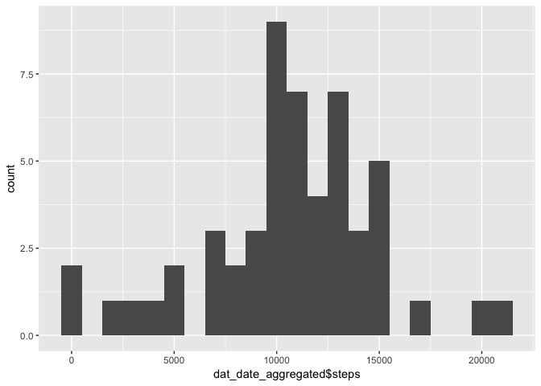
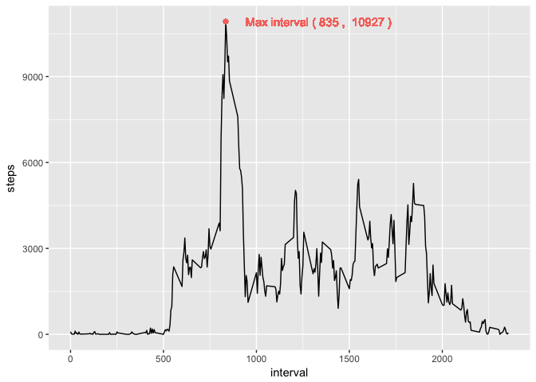
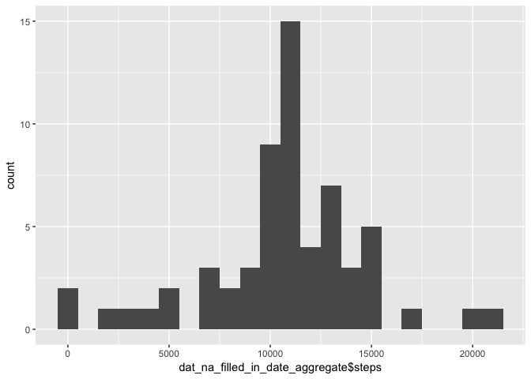
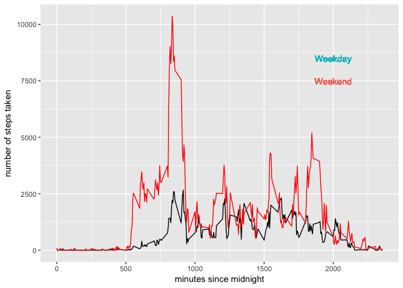

# Reproducible Research: Peer Assessment 1
## Importing the relevant packages

```r
        library(ggplot2)
```

## Loading and preprocessing the data

```r
        dat = read.csv('activity.csv')
        summary(dat)
```

```
##      steps                date          interval     
##  Min.   :  0.00   2012-10-01:  288   Min.   :   0.0  
##  1st Qu.:  0.00   2012-10-02:  288   1st Qu.: 588.8  
##  Median :  0.00   2012-10-03:  288   Median :1177.5  
##  Mean   : 37.38   2012-10-04:  288   Mean   :1177.5  
##  3rd Qu.: 12.00   2012-10-05:  288   3rd Qu.:1766.2  
##  Max.   :806.00   2012-10-06:  288   Max.   :2355.0  
##  NA's   :2304     (Other)   :15840
```

## What is mean total number of steps taken per day?
First I must sum the number of steps taken per day. For this I use the aggregate function.

```r
        dat_date_aggregated <- aggregate(steps ~ date, dat, sum)
```
The mean and median of steps taken per day is the following:

```r
        summary(dat_date_aggregated$steps)
```

```
##    Min. 1st Qu.  Median    Mean 3rd Qu.    Max. 
##      41    8841   10760   10770   13290   21190
```
Making a histrogram showing the distribution of steps per day

```r
        ggplot(data=dat_date_aggregated, aes(dat_date_aggregated$steps)) + geom_histogram(binwidth = 1000)
```

<!-- -->
## What is the average daily activity pattern?
Make a time series plot (i.e. 𝚝𝚢𝚙𝚎 = "𝚕") of the 5-minute interval (x-axis) and the average number of steps taken, averaged across all days (y-axis). 

Avaging the number of steps taken each 5-min interval across all days:

```r
        five_min_interval_aggregate <- aggregate(steps ~ interval, dat, sum)        
```
Finding the 5-min interval with the highest average number of steps

```r
        index_of_max_setps <- which.max(five_min_interval_aggregate$steps)
        max_interval <- five_min_interval_aggregate$interval[index_of_max_setps]
        max_step <- five_min_interval_aggregate$steps[index_of_max_setps]
```

Showing the time series plot together with the position of the maximum interval.

```r
        label_string = paste('Max interval (', toString(max_interval), ', ', toString(max_step),')')
        ggplot(data=five_min_interval_aggregate, aes(interval,steps)) + geom_line() + geom_point(aes(max_interval, max_step, colour='red')) + geom_text(aes(max_interval+500, max_step, label = label_string, colour = 'red') ) + theme(legend.position = "none")
```

<!-- -->

The 5-minute interval, onaveraged across all the days in the dataset, containing the maximum number of steps is: 835, and the avaerage number og steps taken in that interval is: 10927  

## Imputing missing values
Calculate and report the total number of missing values in the dataset is:

```r
        sum(is.na(dat))
```

```
## [1] 2304
```
the total number of missing values in the dataset is 2304.

I fill out all the missing values using the mean for that interval. 

```r
        dat_na_filled_in <- dat
        per_interval_mean <- aggregate(steps ~ interval, dat_na_filled_in, mean) 
        
        indices <- which(is.na(dat_na_filled_in$steps))
        relevant_intervals <- dat_na_filled_in$interval[indices]
        indices_of_intervals <- which(per_interval_mean == relevant_intervals)
        relevant_mean  <- per_interval_mean$steps[indices_of_intervals]
        
        dat_na_filled_in$steps[indices] <- relevant_mean
```

Make a histogram of the total number of steps taken each day and Calculate and report the mean and median total number of steps taken per day. 

```r
        dat_na_filled_in_date_aggregate <- aggregate(steps ~ date, dat_na_filled_in, sum)
        ggplot(data=dat_na_filled_in_date_aggregate, aes(dat_na_filled_in_date_aggregate$steps)) + geom_histogram(binwidth = 1000)
```

<!-- -->

For easy reference, the values before filling in the NAs were:

```r
        summary(dat_date_aggregated)
```

```
##          date        steps      
##  2012-10-02: 1   Min.   :   41  
##  2012-10-03: 1   1st Qu.: 8841  
##  2012-10-04: 1   Median :10765  
##  2012-10-05: 1   Mean   :10766  
##  2012-10-06: 1   3rd Qu.:13294  
##  2012-10-07: 1   Max.   :21194  
##  (Other)   :47
```
After, they ar:

```r
        summary(dat_na_filled_in_date_aggregate)
```

```
##          date        steps      
##  2012-10-01: 1   Min.   :   41  
##  2012-10-02: 1   1st Qu.: 9819  
##  2012-10-03: 1   Median :10766  
##  2012-10-04: 1   Mean   :10766  
##  2012-10-05: 1   3rd Qu.:12811  
##  2012-10-06: 1   Max.   :21194  
##  (Other)   :55
```
Do these values differ from the estimates from the first part of the assignment? What is the impact of imputing missing data on the estimates of the total daily number of steps?

The median and mean change by inserting values for the NAs. The result is a lower median (by 500) and a lower mean (by 1200),

## Are there differences in activity patterns between weekdays and weekends?
Create a new factor variable in the dataset with two levels – “weekday” and “weekend” indicating whether a given date is a weekday or weekend day.

```r
        dat_na_filled_in$day <- weekdays(as.Date(dat_na_filled_in$date))
        dat_na_filled_in$day[grepl("S|L", dat_na_filled_in$day)] <- "weekend"
        dat_na_filled_in$day[grepl("M|T|O|F", dat_na_filled_in$day)] <- "weekday"
```
Make a panel plot containing a time series plot (i.e. 𝚝𝚢𝚙𝚎 = "𝚕") of the 5-minute interval (x-axis) and the average number of steps taken, averaged across all weekday days or weekend days (y-axis). 

```r
        five_min_interval_aggregate_weekend <- aggregate(steps ~ interval, 
                data = subset(dat_na_filled_in, dat_na_filled_in$day=="weekend"), 
                sum)  
        five_min_interval_aggregate_weekday <- aggregate(steps ~ interval, 
                data = subset(dat_na_filled_in, dat_na_filled_in$day=="weekday"), 
                sum) 
```


```r
        pl1 <- ggplot(data=five_min_interval_aggregate_weekend,
                aes(interval, steps)) + 
                geom_line(colour='black') 
        pl1 <- pl1 + geom_line(data=five_min_interval_aggregate_weekday,
                aes(interval, steps), 
                colour='red') 
        pl1 <- pl1 + xlab('minutes since midnight') +
                ylab('number of steps taken') + 
                geom_text(aes(2000, 8500, label = "Weekday", colour = 'red') ) + 
                geom_text(aes(2000, 7500, label = "Weekend", colour = 'black') ) +
                theme(legend.position = "none")
        pl1
```

<!-- -->

Why the blue text is blue when I'm telling it to be black will forever be a mystery to me

